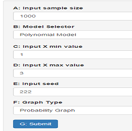

##Introduction
This logistical regression trainer targets people acquainted with the notion of logistical regression who wish to get a more practical feel for how well such regression tracks the underlying true values. 

In applied circumstances a logistical regression model is assumed to be correct with the "true coefficients" unknown. By contrast in a Monte Carlo simulation we have the advantage of knowing the true coefficients so that we can see how much the regression estimates deviate from the correct values.

This trainer enables the user to study the following issues:

1. How well do the regression estimates approximate the true values as the sample size grows. (cf Input Sample Size)

2. How well does the regression generalize outside the sample set (vary X min and X max)

3. Sensitivity to random differences in sample values (vary seed value)

4. Study how correlation of covariates affect accuracy (cf Model Selector Type)

5. See how the s-function transforms the log odds into probabilities (cf. Graph Type)

## Trainer Structure
The trainer enables the user to do logistical regressions on a polynomial model

$\rho(x) = -2  + 0.5x + 0.1 x^2$

and on a harmonic model

$\rho(x) = \sin(x) + 3\cos(x) + 2\sin(2x) + 4\cos(2x)$.

Recall that $prob(x) = s(\rho(x)) = (1 + \exp(-\rho(x)))^{-1}$

These models may be selected using the trainer's model selector button.

The trainer creates trial samples by first selecting n independently chosen values of $X$ where $X$ is uniformly distributed over its minimum and maximum values and then performs a sub-randomization based on the selected log odds equation to choose between the two alternatives.

For example, suppose the polynomial model is active and that $\min X$ and $\max X$ are 1 and 3 respectively, with the sample size set to 100. The trainer then generates 100 $x_i$ values uniformly generated over the interval [1, 3], and then does a coin toss with probability of heads is given by $prob(\rho(x_i))$ where $\rho(x_i) = -2  + 0.5x_i + 0.1 x_i^2$.

Results are presented as either the probability curves or log odd curves that are sub-labelled with legends indicating estimated coefficient values and the actual coefficients.

The polynomial model was chosen to provide the user with some feel for how closely correlated covariates can be rather insensitive to the estimated regression coefficients relative to its probability outputs (see suggested experiment **I**). In contrast the harmonic model components are comparatively
orthogonal showing less sensitivity to varying $X$'s minimum and maximum values (see experiment **II**).

## Running an Experiment
To run a logistical regression trainer experiment one sets the sample size, the model type, min X, max X, seed and graph type corresponding to
input fields A-F, and then depresses the submit button G. The default setting for inputs A-F correspond to suggested experiment <b>I</b> given in the next section (see the graphic entitled "Trainer Input Controls" for additional details)

### Suggested Experiments

<table border="1" style="width:100%">
<tr>
<th>Sample Size</th>
<th>Model</th> 
<th>Min X</th>
<th>Max X</th>
<th>Seed</th>
<th>Graph Type</th>
<th>Exper</th>
</tr>
<tr>
<td>1000</td>
<td>Poly</td> 
<td>1</td>
<td>3</td>
<td>222</td>
<td>Prob</td>
<td><b><i>I</i></b></td>
 </tr>
 <tr>
<td>1000</td>
<td>Harmonic</td> 
<td>1</td>
<td>3</td>
<td>222</td>
<td>Prob</td>
<td><b><i>II</i></b></td>
 </tr>
 <tr>
<td>1000</td>
<td>Poly</td> 
<td>0.3</td>
<td>3</td>
<td>222</td>
<td>Prob</td>
<td><b><i>III</i></b></td>
</tr>
<tr>
<td>1000</td>
<td>Poly</td> 
<td>0.3</td>
<td>5</td>
<td>222</td>
<td>Prob</td>
<td><b><i>VI</i></b></td>
</tr>
<tr>
<td>5000</td>
<td>Poly</td> 
<td>1</td>
<td>3</td>
<td>222</td>
<td>Prob</td>
<td><b><i>I'</i></b></td>
</tr>
<tr>
<td>5000</td>
<td>Poly</td> 
<td>1</td>
<td>3</td>
<td>223</td>
<td>Prob</td>
<td><b><i>I''</i></b></td>
</tr>
<tr>
<td>5000</td>
<td>Harmonic</td> 
<td>1</td>
<td>3</td>
<td>222</td>
<td>Prob</td>
<td><b><i>II'</i></b></td>
 </tr>
 
<tr>
<td>5000</td>
<td>Harmonic</td> 
<td>1</td>
<td>3</td>
<td>223</td>
<td>Prob</td>
<td><b><i>II''</i></b></td>
 </tr>
</table>

###Expected Results
<table border="1" style="width:100%">
<tr>
<th>Sample Size</th>
<th>Model</th> 
<th>Coef 1</th>
<th>Coef 2</th>
<th>Coef 3</th>
<th>Coef 4</th>
<th>Exper</th>
</tr>
<tr>
<td>1000</td>
<td>Poly</td> 
<td>-1.03</td>
<td>-0.36</td>
<td>0.29</td>
<td>NA</td>
<td><b><i>I</i></b></td>
 </tr>
 <tr>
<td>1000</td>
<td>Harmonic</td> 
<td>1.14</td>
<td>3.11</td>
<td>2.07</td>
<td>4.06</td>
<td><b><i>II</i></b></td>
 </tr>
 <tr>
<td>1000</td>
<td>Poly</td> 
<td>-1.77</td>
<td>0.20</td>
<td>0.17</td>
<td>NA</td>
<td><b><i>III</i></b></td>
</tr>
<tr>
<td>1000</td>
<td>Poly</td> 
<td>-1.98</td>
<td>0.49</td>
<td>0.12</td>
<td>NA</td>
<td><b><i>VI</i></b></td>
</tr>
<tr>
<td>5000</td>
<td>Poly</td> 
<td>-2.19</td>
<td>0.63</td>
<td>0.07</td>
<td>NA</td>
<td><b><i>I'</i></b></td>
 </tr>
<tr>
<td>5000</td>
<td>Poly</td> 
<td>-1.51</td>
<td>0.05</td>
<td> 0.24</td>
<td>NA</td>
<td><b><i>I''</i></b></td>
</tr>
<tr>
<td>5000</td>
<td>Harmonic</td> 
<td>0.97</td>
<td>2.86</td>
<td>1.99</td>
<td>3.90</td>
<td><b><i>II'</i></b></td>
</tr>
<tr>
<td>5000</td>
<td>Harmonic</td> 
<td>1.07</td>
<td>2.88</td>
<td>1.97</td>
<td>3.94</td>
<td><b><i>II''</i></b></td>
 </tr>
</table>

####Discussion
We see from experiments <b>I,III,I'</b> and <b> I''</b> how much coefficient estimates flop around when the sampling interval is constrained to intervals where the regressors $1, x, x^2$ have a high degree of correlation. If one varies experiment <b>IV</b> by varying the seed one sees greater stability since the sampling interval [0.3, 5] is one for which $1, x, x^2$ are more distinguishable.

In contrast from experiments <b>II, II'</b> and <b>II''</b>
the harmonic model shows significant stability in regards to sampling interval and seed value. I conjecture that this stability is due to the distinguishability of the regressors 
$\sin(x), \cos(x), \sin(2x), \cos(2x)$ over most intervals of even modest length.

### Trainer Input Controls

